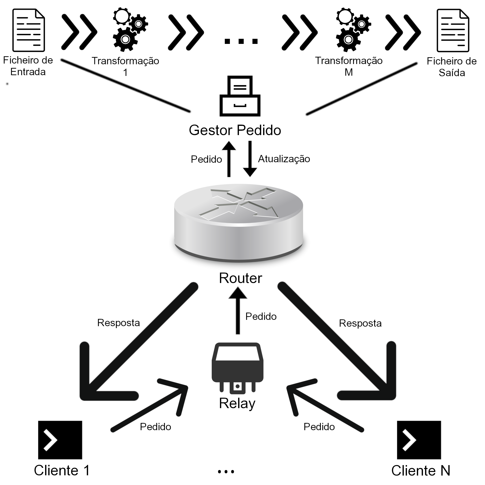

# SDStore
Project for Operating Systems class consisting of a client/server application using pipes in a UNIX environment.

Evaluated as a 19.6 / 20 (best grade in class).

## Team

This project was developed by

- [Rui Oliveira](https://github.com/ruioliveira02/)
- [Luís Pereira](https://github.com/lumafepe/)
- [Tiago Bacelar](https://github.com/tiago-bacelar/)

## Overview

The goal for this project was to create a daemon which would handle file transformations. More specifically, the daemon should receive requests from clients, each request consisting of input and output files, and the transformations the input should go through before being output (there was a priority argument as well).

Each transformation was a pre compiled executable file the daemon had access to and would call when required. There was a hard limit on the number of parallel transformations that could be run simultaneously.

All of this had to be accomplished in a UNIX environment with the appropriate system calls and with the maximum possible concurrency.


## Solution

The daemon and clients would communicate via a common FIFO. In each request, the client would specify all the needed parameters, as well as a priority (by default 0, higher values mean higher priorities, up to a maximum of 5), and the name of the FIFO it will use to receive responses from the daemon.

The daemon would then redirect the request to the main server FIFO (the router), which receives updates from every transformation / request being processed. Whenever a new update is received in the router, it checks if there is a request that can be executed and, if so, chooses the one with the highest priority.

Each request is processed by a child process of the router, which creates the pipeline to do the transformations, similarly to a bash pipe (```|```) operator.

The architecture is described in the following image (PT).

</img>
### Priorities

The feature which really made this project stood out was how priorities were implemented.

To our group a process would be the highest priority if and only if it had a higher priority value than every other request in line, or would be the oldest one in case of a tie.

A request would execute if and only if

> it were the highest priority request for each of the transformations it uses.

This means that a lower priority request could execute first than a higher priority one, as long as it executing would not delay the execution of the higher priority one, resulting in a higher throughput than if one were to blindly follow the priority.

### Testing

A set of tests was developed in Python in order to measure the performance of the application, ranging from a large volume of small files to a small collection of very large files (up to tens of gigabytes)

## Running the project

To compile the project run

```make```

To run the daemon (only works in an ***UNIX*** environment) run

```./bin/sdstored config/config.txt bin/```

To call the client run 

```./bin/sdstore proc-file -p <priority> <input-file> <output-file> <transformation-1> ... <transformation-n>```

The available transformations are located in ```bin/``` and are used by inputting a file's content to the standard input, and will output to the standard output.

Note that some transformations require additional dependencies in order to work (ccrypt).

To close the daemon, send a ```SIGTERM``` signal to it.

## Improvements

Some possible improvements to the application are

- The way the daemon responds to status requests. Right now it is linear in the number of processed requests, and it could have been more efficiently implemented
- Responding to the clients should have been done in a child process to prevent blocking from a full pipe
- Adding more options to the daemon, mainly related to logging to a file instead of to standard output
  
## Thoughts and Conclusion

Overall, this was one of the most solid projects developed for a class. The features were implemented and in many instances improved upon the original requirements, and the application was tested extensively.

Therefore, not a lot could have been better and I am very proud of this project.